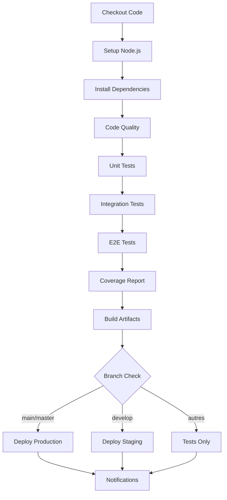

# 🎉 Jenkinsfile et Configuration CI/CD Créés

## ✅ Fichiers Créés

### 1. **Jenkinsfile** - Pipeline Principal
- Pipeline complet avec 10 étapes
- Tests parallélisés (Unit, Integration, E2E)
- Rapports automatisés (Coverage, Playwright)
- Déploiement automatique par branche
- Notifications et nettoyage automatique

### 2. **JENKINS.md** - Documentation Complète
- Guide de configuration Jenkins
- Instructions d'installation des plugins
- Explication de chaque étape du pipeline
- Guide de débogage et bonnes pratiques
- Métriques et monitoring

### 3. **deploy.sh** - Script de Déploiement
- Déploiement automatisé (staging/production)
- Système de backup et rollback
- Tests de santé post-déploiement  
- Smoke tests automatiques
- Notifications de statut

### 4. **Dockerfile** - Conteneurisation
- Build multi-stage optimisé
- Tests intégrés dans le build
- Utilisateur non-root pour la sécurité
- Health checks automatiques
- Image de production minimale

### 5. **Configuration Mise à Jour**
- **package.json**: Scripts CI ajoutés, jest-junit configuré
- **.dockerignore**: Optimisation du contexte Docker
- **README.md**: Documentation CI/CD ajoutée

## 🔧 Pipeline Jenkins - Aperçu



## 📊 Fonctionnalités du Pipeline

### Tests Automatisés
- ✅ **Tests Unitaires**: TaskUtils avec couverture
- ✅ **Tests d'Intégration**: Service-Model interactions
- ✅ **Tests E2E**: Playwright multi-navigateurs
- ✅ **Couverture de Code**: Seuil minimum 80%

### Qualité du Code
- ✅ **Linting**: Vérification syntaxe JavaScript
- ✅ **Security Audit**: npm audit à chaque build
- ✅ **Validation**: Tests de régression complets

### Déploiement
- ✅ **Multi-Environnements**: Staging + Production
- ✅ **Déploiement par Branches**: main → Production, develop → Staging
- ✅ **Rollback Automatique**: En cas d'échec des tests
- ✅ **Health Checks**: Vérification post-déploiement

### Rapports et Artefacts
- ✅ **HTML Reports**: Coverage + Playwright
- ✅ **JUnit XML**: Intégration Jenkins
- ✅ **Build Artifacts**: Package de déploiement
- ✅ **Version Tracking**: Métadonnées de build

## 🚀 Mise en Route

### 1. Configuration Jenkins

```bash
# Plugins requis
- NodeJS Plugin
- HTML Publisher Plugin
- JUnit Plugin
- Pipeline Plugin

# Configuration Node.js
Manage Jenkins → Global Tool Configuration → NodeJS
Name: "Node 18"
Version: 18.x.x
```

### 2. Création du Job

```bash
# Nouveau Pipeline Job
New Item → Pipeline
Pipeline → Definition: Pipeline script from SCM
SCM: Git
Repository URL: [votre-repo]
Branch: */main
Script Path: Jenkinsfile
```

### 3. Variables d'Environnement

```bash
NODE_VERSION = '18'
APP_NAME = 'todo-app'  
DEPLOY_PORT = '3000'
```

## 📋 Commandes Disponibles

### Tests CI
```bash
npm run test:ci              # Tests avec rapports JUnit
npm run test:coverage        # Coverage complet
npm run audit:check          # Audit de sécurité
```

### Déploiement
```bash
./deploy.sh staging          # Déploiement staging
./deploy.sh production v1.0  # Déploiement production
```

### Docker
```bash
docker build -t todo-app .   # Build image
docker run -p 3000:3000 todo-app  # Run container
```

## 📈 Métriques du Pipeline

| Métrique | Valeur Cible |
|----------|--------------|
| Temps d'exécution | ~15-20 minutes |
| Couverture de code | > 80% |
| Taux de réussite | > 95% |
| Temps de feedback | < 5 minutes (unitaires) |

## 🔐 Sécurité Implémentée

- ✅ Audit des dépendances NPM
- ✅ Utilisateur non-root dans Docker
- ✅ Nettoyage automatique du workspace
- ✅ Timeout protection (20 minutes)
- ✅ Credentials sécurisés via Jenkins

## 📚 Documentation

- **[JENKINS.md](JENKINS.md)**: Guide complet Jenkins
- **[README.md](README.md)**: Documentation projet mise à jour
- **[TESTING.md](TESTING.md)**: Guide des tests existants
- **[NOUVEAUX_TESTS.md](NOUVEAUX_TESTS.md)**: Tests supplémentaires

## 🎯 Prochaines Étapes

1. **Configurer Jenkins** avec les plugins requis
2. **Créer le job Pipeline** pointant vers le Jenkinsfile
3. **Tester le pipeline** sur une branche de test
4. **Configurer les notifications** (Slack, email)
5. **Mettre en place les serveurs** de staging/production

Votre pipeline CI/CD est maintenant prêt à être utilisé ! 🚀